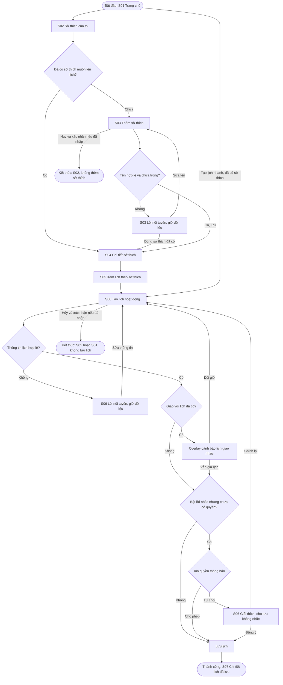
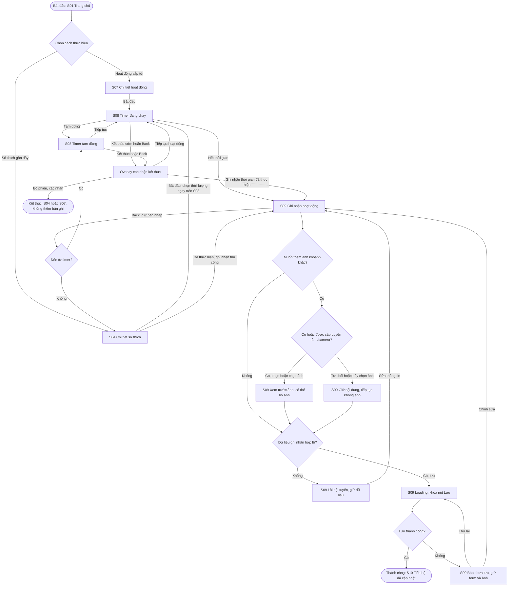
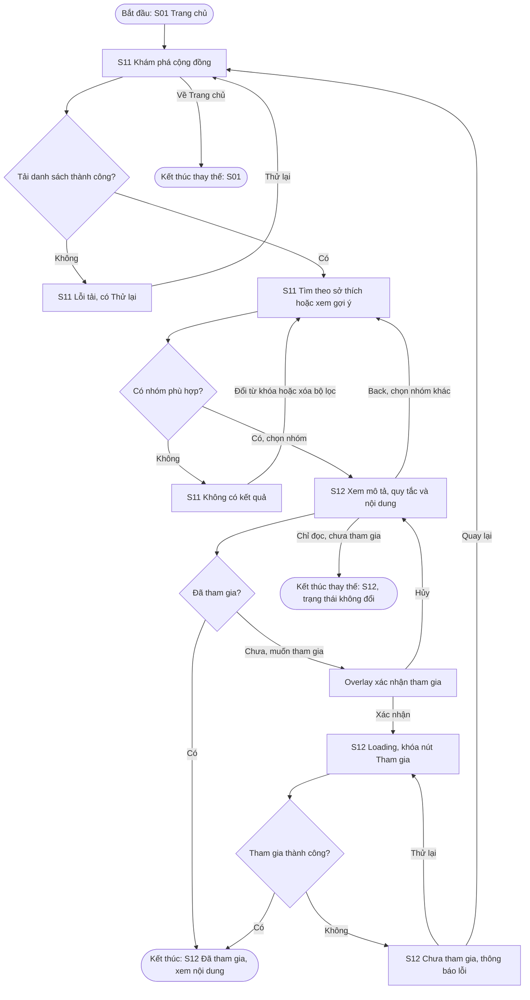

# Kiến trúc thông tin và user flow của Hobby Tracker

## 1. Giới thiệu

Tài liệu mô tả các màn hình và luồng sử dụng của Hobby Tracker, dựa trên persona Minh Anh trong [persona.md](persona.md), file `HOBBY TRACKER USER STORIES.docx` và yêu cầu của Lab 2.

File user stories sử dụng tên Fetch Timer. Trong bộ tài liệu thiết kế này, nhóm thống nhất dùng tên **Hobby Tracker**.

Ứng dụng hướng đến sinh viên muốn dành thời gian cho sở thích nhưng khó duy trì đều đặn vì lịch học thay đổi. Minh Anh cần biết khi nào có thể đọc sách hoặc tập guitar, ghi lại những gì đã làm và xem mình tiến bộ ra sao. Timer, lời nhắc, ảnh kỷ niệm và cộng đồng giúp việc duy trì sở thích thuận tiện hơn.

Các luồng dưới đây là phương án thiết kế để nhóm làm tiếp trên Stitch và Figma, chưa được kiểm chứng với người dùng. Prototype sẽ dùng dữ liệu mẫu; Lab 2 không yêu cầu triển khai backend hay viết code Flutter.

## 2. Điều chỉnh từ user stories

Để dễ đối chiếu, các nhu cầu trong file gốc được đánh số từ US01 đến US10 theo thứ tự xuất hiện. Bảng dưới ghi cách hiểu và hướng xử lý đề xuất cho từng nhu cầu; file DOCX gốc vẫn được giữ nguyên.

| Mã | Nhu cầu ban đầu | Hướng xử lý đề xuất | Flow liên quan |
| --- | --- | --- | --- |
| US01 | Sắp xếp thời gian biểu, sự kiện, nhiệm vụ và lịch trình cá nhân | Tập trung vào lịch hoạt động sở thích. Người dùng chọn ngày, giờ và thời lượng phù hợp với lịch học. | F01 |
| US02 | Báo thức và đánh dấu mốc thời gian | Cho phép đặt lời nhắc trước hoạt động và xem hoạt động trên lịch. Nếu muốn có báo thức riêng, nhóm cần thống nhất thêm cách hoạt động. | F01, gồm trường hợp không cấp quyền thông báo |
| US03 | Tích hợp Spotify, YouTube để tập trung | Để ở giai đoạn mở rộng. Trước khi thiết kế, cần chốt ứng dụng chỉ mở liên kết hay cho phát nội dung bên trong. | Chưa đưa vào ba flow |
| US04 | Nhắc nhở hằng ngày để tăng tập trung | Người dùng tự chọn lời nhắc theo lịch hoạt động, có thể bỏ qua hoặc tắt. Ứng dụng không mặc định nhắc mỗi ngày. | F01 |
| US05 | Tập trung, tối ưu thời gian dành cho sở thích | Cho người dùng chọn thời lượng, tạm dừng khi cần và ghi lại thời gian đã thực hiện. | F02 |
| US06 | Tracking và đóng góp chuyên sâu về chủ đề sở thích | Trước mắt, theo dõi bằng lịch sử, thời gian và ghi chú hoạt động. Phần đóng góp hoặc tư vấn chuyên sâu cần làm rõ ai cung cấp và cung cấp nội dung gì. | F02 cho phần theo dõi; phần chuyên sâu cần làm rõ |
| US07 | Kết nối người có cùng sở thích | Bắt đầu bằng việc tìm nhóm, xem thông tin và tham gia. Nhắn tin, đăng bài và quản trị nhóm để xem xét sau. | F03 |
| US08 | Biến sở thích thành điều đặc biệt trong cuộc sống | Cho phép đặt mục tiêu thời gian mỗi tuần nếu muốn, rồi nhìn lại những hoạt động đã thực hiện. | F01 để đặt mục tiêu, F02 để xem tiến bộ |
| US09 | Được truyền cảm hứng mỗi ngày | Cho người dùng chủ động xem nội dung ngắn trong nhóm sở thích. Việc cập nhật hằng ngày và cá nhân hóa cần được bàn thêm. | F03 |
| US10 | Lưu khoảnh khắc với sở thích bằng ảnh | Cho phép thêm ảnh hoặc ghi chú khi lưu hoạt động. Người dùng vẫn lưu được nếu không thêm ảnh hoặc từ chối quyền ảnh/camera. | F02 |

Với phạm vi này, nhóm có thể hoàn thiện ba flow phục vụ nhu cầu của Minh Anh trước. Spotify/YouTube, báo thức riêng và tư vấn chuyên sâu sẽ được xem xét lại khi đã có yêu cầu cụ thể hơn.

## 3. Danh sách màn hình

Ứng dụng gồm **12 màn hình riêng biệt**. Màn thêm và sửa dùng chung một form. Các trạng thái, hộp thoại và giao diện xin quyền của hệ điều hành không được tính là màn hình riêng.

| ID | Màn hình | Mục đích và nội dung chính | Cấp điều hướng | Flow sử dụng |
| --- | --- | --- | --- | --- |
| S01 | Trang chủ | Xem hoạt động sắp tới, sở thích gần đây và tổng quan tuần; mở nhanh các tác vụ thường dùng. | Cấp cao nhất | F01, F02, F03 |
| S02 | Sở thích của tôi | Xem danh sách, chọn một sở thích hoặc thêm sở thích mới. | Cấp cao nhất | F01 |
| S03 | Thêm hoặc sửa sở thích | Nhập tên sở thích; thêm biểu tượng và mục tiêu số phút mỗi tuần nếu muốn. | Màn con của S02 hoặc S04 | F01 |
| S04 | Chi tiết sở thích | Xem mục tiêu, lịch sử; lên lịch, bắt đầu hoạt động, ghi nhận thủ công hoặc xem tiến bộ. | Màn con của S02; cũng mở được từ S01 | F01, F02 |
| S05 | Lịch hoạt động | Xem lịch theo ngày, lọc theo sở thích, mở một hoạt động hoặc tạo lịch mới. | Cấp cao nhất | F01 |
| S06 | Tạo hoặc sửa lịch hoạt động | Chọn sở thích, nhập tên hoạt động, ngày, giờ, thời lượng và đặt lời nhắc nếu muốn. | Màn con của S05; cũng mở nhanh được từ S01 | F01 |
| S07 | Chi tiết hoạt động đã lên lịch | Thông tin lịch, lời nhắc, sửa lịch và bắt đầu thực hiện hoạt động. | Màn con của S05 hoặc S01 | F01, F02 |
| S08 | Thực hiện hoạt động | Sở thích và hoạt động đang thực hiện, thời lượng, timer, tạm dừng, tiếp tục và kết thúc. | Màn con của S04 hoặc S07 | F02 |
| S09 | Ghi nhận hoạt động | Lưu sở thích, ngày thực hiện và số phút thực tế; thêm ghi chú hoặc ảnh nếu muốn. | Màn con của S08; cũng mở để ghi nhận thủ công từ S04 | F02 |
| S10 | Tiến bộ của sở thích | Tổng thời gian, số hoạt động đã ghi nhận, lịch sử gần đây và tiến độ so với mục tiêu tuần nếu có. | Màn con của S04; có lối vào từ S01 | F02 |
| S11 | Khám phá cộng đồng | Tìm hoặc lọc nhóm theo sở thích; danh sách nhóm gợi ý và kết quả tìm kiếm. | Cấp cao nhất | F03 |
| S12 | Chi tiết nhóm sở thích | Mô tả nhóm, quy tắc, nội dung gợi cảm hứng mẫu và trạng thái tham gia. | Màn con của S11 | F03 |

### Cấu trúc điều hướng

Thanh điều hướng chính gồm **Trang chủ – Sở thích – Lịch – Cộng đồng**. Các màn con có nút Quay lại (Back). Màn Tiến bộ được mở theo từng sở thích, giúp người dùng biết mình đang xem kết quả của hoạt động nào.

```text
S01 Trang chủ
├── S02 Sở thích của tôi
│   ├── S03 Thêm sở thích
│   └── S04 Chi tiết sở thích
│       ├── S03 Sửa sở thích
│       ├── S05 Lịch, lọc theo sở thích
│       ├── S08 Thực hiện hoạt động
│       │   └── S09 Ghi nhận hoạt động
│       ├── S09 Ghi nhận thủ công
│       └── S10 Tiến bộ của sở thích
├── S05 Lịch hoạt động
│   ├── S06 Tạo lịch
│   └── S07 Chi tiết hoạt động
│       ├── S06 Sửa lịch
│       └── S08 Thực hiện hoạt động
├── S11 Khám phá cộng đồng
│   └── S12 Chi tiết nhóm sở thích
├── S06 Tạo lịch nhanh
├── S04 Sở thích gần đây
├── S07 Hoạt động sắp tới
└── S10 Tiến bộ của một sở thích được chọn
```

Một màn hình có thể xuất hiện ở nhiều nhánh vì có nhiều cách mở màn hình đó. Người dùng cũng có thể đến thẳng S02, S05 và S11 từ thanh điều hướng chính.

### Khi quay lại hoặc rời màn hình

- Nút Back trên màn chi tiết đưa người dùng về nơi vừa mở màn hình đó. Ngày đang xem, bộ lọc và từ khóa tìm kiếm được giữ lại.
- Sau khi thêm sở thích ở S03, ứng dụng mở S04. Từ đây, Back trở về S02. Nếu đang sửa sở thích, lưu xong sẽ trở về S04 đang xem.
- Sau khi lưu lịch ở S06, ứng dụng mở S07 thay cho form vừa nhập. Back trở về S05 nếu tạo từ Lịch, hoặc S01 nếu tạo nhanh từ Trang chủ. Nếu đang sửa lịch, lưu xong sẽ trở về S07 đang xem.
- Nếu rời form có thay đổi chưa lưu, ứng dụng hỏi người dùng muốn tiếp tục chỉnh sửa hay bỏ thay đổi để quay lại.
- Ở S08, timer giữ nguyên thời gian khi tạm dừng. Nếu nhấn Back hoặc kết thúc sớm, một hộp thoại overlay cho phép tiếp tục, ghi nhận thời gian đã thực hiện hoặc xác nhận bỏ phiên.
- Từ S09, Back trở về timer đang tạm dừng nếu trước đó dùng S08, hoặc về S04 nếu ghi nhận thủ công. Dữ liệu đang nhập được giữ lại khi lưu thất bại.
- Khi lưu thành công ở S09, phiên hoạt động kết thúc và ứng dụng mở S10 của sở thích tương ứng. Back từ S10 trở về S04, không mở lại timer đã kết thúc.

## 4. F01 Quản lý sở thích và lên lịch hoạt động

Minh Anh muốn dành thời gian cho một sở thích nhưng cần sắp xếp cho phù hợp với lịch học. Luồng này giúp Minh Anh chọn hoặc thêm sở thích, sau đó tạo lịch hoạt động.

Luồng bắt đầu ở **S01 Trang chủ** và hoàn thành khi **S07 hiển thị lịch đã lưu**. Nếu hủy, người dùng trở về màn trước và không tạo thêm dữ liệu.

Người dùng có thể đã có sở thích hoặc đang bắt đầu với danh sách rỗng. Việc tạo lịch không bắt buộc phải cấp quyền thông báo.

**Luồng chính (happy path):** S01 → S02 → chọn sở thích có sẵn → S04 → S05 → S06 → nhập lịch hợp lệ → lưu → S07.

**Các cách khác:** nếu chưa có sở thích, Minh Anh thêm ở S03 trước. Khi đã có sở thích, có thể tạo lịch nhanh từ S01. Lời nhắc là tùy chọn và người dùng có thể hủy form. Khi cần sửa lịch, mở S07 → S06 → lưu để trở về S07.

**Khi gặp lỗi:** tên sở thích không được để trống. Sau khi bỏ khoảng trắng thừa, nếu tên trùng với sở thích đã có, ứng dụng cho đổi tên hoặc chọn sở thích đó. Với lịch hoạt động, thông báo lỗi xuất hiện ngay tại ô nhập thiếu hoặc sai; thời lượng phải lớn hơn 0 và thời điểm bắt đầu không được ở quá khứ. Nếu hai lịch giao nhau, người dùng được cảnh báo và có thể đổi giờ hoặc xác nhận giữ cả hai.



Khi báo lỗi, ứng dụng cần chỉ rõ ô nào phải sửa và giữ lại phần đã nhập. Sau khi lưu, S07 hiển thị thông báo thành công cùng trạng thái lời nhắc đã chọn.

Đường tạo lịch nhanh S01 → S06 → S07 sẽ dùng để kiểm tra mục tiêu trong persona: tạo lịch trong tối đa 30 giây khi đã có sở thích. Thời gian này cần được đo lại khi thử prototype.

## 5. F02 Thực hiện, ghi nhận và xem tiến bộ của sở thích

Minh Anh muốn ghi lại buổi đọc sách hoặc tập guitar để biết mình đã dành bao nhiêu thời gian cho sở thích. Có thể dùng timer trong lúc thực hiện hoặc nhập lại sau, thêm ảnh nếu muốn, rồi xem tiến bộ của sở thích đó.

Luồng bắt đầu ở **S01 Trang chủ** và hoàn thành khi **S10 cập nhật hoạt động vừa lưu**. Nếu bỏ phiên, người dùng trở về S04 hoặc S07 đã mở trước đó và không có bản ghi mới.

Người dùng cần có ít nhất một sở thích. Hoạt động có thể đã được lên lịch hoặc bắt đầu trực tiếp từ sở thích. Nếu ghi nhận thủ công, không cần tạo lịch trước.

**Luồng chính (happy path):** S01 → S07 hoạt động sắp tới → S08 bắt đầu timer → hoàn thành → S09 xem lại thời gian, thêm ghi chú nếu muốn → lưu → chờ xử lý → S10 cập nhật tiến bộ.

**Các cách khác:** Minh Anh có thể mở S01 → S04 → S09 để ghi nhận một hoạt động đã làm. Khi dùng timer, có thể tạm dừng, tiếp tục hoặc kết thúc sớm để lưu thời gian đã thực hiện. Ảnh là tùy chọn; nếu chưa muốn lưu, người dùng có thể quay lại.

**Khi gặp lỗi:** hoạt động phải được gắn với một sở thích, có số phút lớn hơn 0 và ngày thực hiện không ở tương lai. Nếu từ chối quyền ảnh/camera, người dùng vẫn lưu được hoạt động không có ảnh. Nếu lưu thất bại, ứng dụng giữ nội dung đã nhập để người dùng thử lại hoặc chỉnh sửa.



Hoạt động mới được lên lịch chưa được tính vào thời gian đã thực hiện. S04 và S10 chỉ cập nhật sau khi bản ghi được lưu thành công. Nếu ghi nhận thủ công, người dùng tự nhập số phút; nếu dùng timer, thời gian được điền sẵn và vẫn có thể sửa. Khi chưa đặt mục tiêu tuần, S10 chỉ hiển thị lịch sử và tổng thời gian, không hiển thị phần trăm hoàn thành.

Theo mục tiêu trong persona, việc bắt đầu cần gói gọn trong tối đa 3 thao tác từ Trang chủ. Với hoạt động đã lên lịch, người dùng mở S07 rồi nhấn Bắt đầu để chạy timer ở S08, tổng cộng 2 thao tác. Với sở thích gần đây, người dùng mở S04, nhấn Bắt đầu rồi chọn thời lượng ở S08, tổng cộng 3 thao tác. Timer chỉ chạy khi người dùng chủ động bắt đầu. Nhóm cần kiểm tra lại số thao tác trên prototype.

## 6. F03 Khám phá cảm hứng và tham gia nhóm sở thích

Minh Anh muốn tìm những người cùng đọc sách hoặc tập guitar để có thêm cảm hứng. Luồng này giúp Minh Anh tìm nhóm, xem nội dung và quy tắc trước khi quyết định tham gia.

Luồng bắt đầu ở **S01 Trang chủ** và hoàn thành khi **S12 hiển thị Đã tham gia**. Người dùng cũng có thể chỉ xem nội dung hoặc quay về S11 để tìm nhóm khác.

Prototype sử dụng nhóm và nội dung mẫu để mô phỏng việc tìm kiếm, xem thông tin và tham gia.

**Luồng chính (happy path):** S01 → S11 tìm nhóm theo sở thích → S12 xem mô tả, quy tắc và nội dung → Tham gia → hộp thoại overlay → xác nhận → S12 Đã tham gia.

**Các cách khác:** Minh Anh có thể chọn nhóm gợi ý thay vì tìm kiếm, hủy hộp thoại tham gia để tiếp tục xem hoặc chỉ đọc nội dung. Nhóm đã tham gia sẽ hiển thị trạng thái tương ứng. Nếu không tìm được nhóm phù hợp, người dùng có thể đổi từ khóa hoặc xóa bộ lọc.

**Khi gặp lỗi:** nếu không tải được danh sách, S11 hiển thị thông báo và nút Thử lại. Nếu tham gia thất bại, S12 giữ trạng thái chưa tham gia cùng thông tin nhóm, cho phép thử lại hoặc quay về S11.



Ở bản thiết kế này, người dùng được xem nội dung mẫu trước khi tham gia để cân nhắc nhóm có phù hợp hay không. Nếu phát triển sản phẩm thực tế, nhóm cần thống nhất thêm nội dung nào công khai và nội dung nào chỉ thành viên được xem.

## 7. Màn hình dùng trong từng flow

| Flow | Màn hình được sử dụng, gồm các nhánh | Trạng thái và overlay chính | User stories |
| --- | --- | --- | --- |
| F01 Quản lý sở thích và lên lịch | S01, S02, S03, S04, S05, S06, S07 | Danh sách rỗng, lỗi tên, lỗi lịch, cảnh báo lịch giao nhau, quyền thông báo bị từ chối, xác nhận bỏ thay đổi, lưu thành công | US01, US02, US04, US08 |
| F02 Thực hiện và theo dõi tiến bộ | S01, S04, S07, S08, S09, S10 | Timer chạy/tạm dừng, overlay kết thúc, lỗi form, quyền ảnh bị từ chối, loading → kết quả, lỗi lưu và thử lại | US05, US06 phần tracking, US08, US10 |
| F03 Khám phá và tham gia cộng đồng | S01, S11, S12 | Loading, lỗi tải, không có kết quả, overlay tham gia/hủy, chưa tham gia/đã tham gia, lỗi tham gia và thử lại | US07, US09 |

S01 được dùng trong cả ba flow. S02–S03 và S05–S06 thuộc F01; S04 và S07 dùng chung cho F01 và F02; S08–S10 thuộc F02; S11–S12 thuộc F03. Như vậy, cả 12 màn hình đều có mặt trong ít nhất một flow.

## 8. Lưu ý khi làm Stitch và Figma

- Dùng thống nhất mã S01–S12 trong prompt, tên frame và `design/screen-spec.md` để các thành viên dễ đối chiếu màn hình với flow.
- Vẽ wireframe cho đủ 12 màn hình. Các trạng thái rỗng, đang tải, lỗi và những biến thể khác đặt cạnh màn hình tương ứng, không tính thành màn hình riêng.
- Đặt ba flow starting point trong Figma cho F01, F02 và F03. Có thể dùng ba instance của S01 với dữ liệu mẫu phù hợp từng flow.
- Kiểm tra để mỗi flow đi được từ đầu đến cuối, có nút Back hoặc Hủy khi cần. Khi gặp lỗi, giữ nội dung đang nhập hoặc trạng thái đang xem để người dùng thử lại.
- Dựng ít nhất một hộp thoại overlay: kết thúc hoạt động ở F02 hoặc xác nhận tham gia ở F03. Nút Hủy cần đóng hộp thoại và giữ nguyên màn hình phía dưới.
- Mô phỏng trạng thái đang lưu ở S09 rồi chuyển sang S10 khi thành công. Khi demo, có thể mô phỏng timer hoàn thành để không phải chờ hết thời gian thực.
- Dùng khung chính 360 × 800 dp và kiểm tra thêm chiều rộng 412 dp. Vùng chạm tối thiểu 48 × 48 dp, chữ nội dung tối thiểu 14 sp. Lỗi và trạng thái cần có chữ hoặc biểu tượng để người dùng hiểu mà không chỉ dựa vào màu.
- Bộ màn hình hiện tại bắt đầu khi người dùng đã có thể sử dụng ứng dụng. Spotify/YouTube, báo thức riêng, tư vấn chuyên sâu và đăng nhập/đăng ký chưa nằm trong phạm vi này. Nếu bổ sung, cần cập nhật đồng thời danh sách màn hình, sơ đồ flow và bảng ánh xạ.
